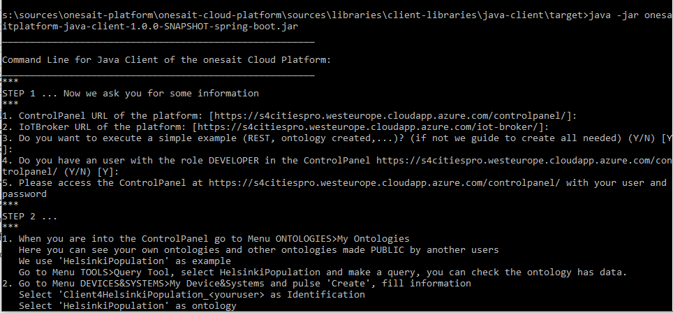
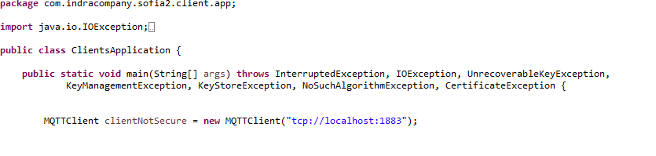
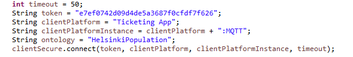
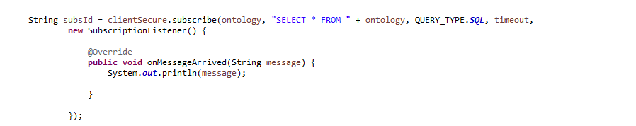

onesait Platform Java Client Library
============================

## Compile the library:
(Take care, in future version '1.0.0-SNAPSHOT' will be another number!)

To use this library you need to:
1. Compile the platform, this generates en your local Maven Repository: $M2_REPO\com\minsait\onesait\platform\onesaitplatform-comms-protocol\1.0.0-SNAPSHOT\onesaitplatform-comms-protocol-1.0.0-SNAPSHOT.jar
2. Compile the client library, this generates $M2_REPO\com\minsait\onesait\platform\onesaitplatform-java-client\1.0.0-SNAPSHOT\\**onesaitplatform-java-client-1.0.0-SNAPSHOT.jar** and $M2_REPO\com\minsait\onesait\platform\onesaitplatform-java-client\1.0.0-SNAPSHOT\\**onesaitplatform-java-client-1.0.0-SNAPSHOT-spring-boot.jar**

## Use the Console included in the Client Library
The Client Library packaged with suffix can be executed stand-alone.
1. Go to $M2_REPO\com\minsait\onesait\platform\onesaitplatform-java-client\1.0.0-SNAPSHOT\
2. Execute **java -jar onesaitplatform-java-client-1.0.0-SNAPSHOT-spring-boot.jar**
3. This shows a console app that guides you in order to execute a test of the platform


## Use the Client Library in your project
If you want to use this client-library:
1. Add following dependency to your project:
```
<dependency>
	<groupId>com.minsait.onesait.platform</groupId>
	<artifactId>onesaitplatform-java-client</artifactId>
	<version>${onesaitplatform.version}</version>
</dependency>
```
2. Go to package ** com.minsait.onesait.platform.client.examples** and review examples:
	* RestAppExample: example of client connecting with REST protocol
	* MQTTApplicationExample: example communicating with MQTT protocol
	* Client4IoTBrokerConsole: console example shown in previous step
	* BinaryRepoAppExample: example for manage binaries with the IoTBroker

## MQTT Client API

MQTTClient API allows your application to connect and send data to the IoT Broker, using MQTT as the transport protocol.

### MQTTS (SSL)
This client allows you to configure MQTT over SSL. To create a secure connection, follow these steps:

-	Create a MQTTSecureConfiguration object specifying the path to your Key Store (.jks), and its password. If one of them is not specified, then default Key Store and password will be used.

-	Create a MQTTClient with the Broker URL and the MQTTSecureConfiguration object.

 


### MQTT not secure
If you don't want to use a secure connection, you may use standard MQTT protocol:




### Connect the client
To connect client to Broker, you need to call method "connect()" with aguments: token, device identification, device instance identification, and timeout for waiting broker response (in seconds). 
   example: client.connect("token", "Device", "Device:mqtt", 5); 




### Publish

You can publish messages through method "publish()", arguments needed: ontology identification name, ontology instance as string (must be json format!), and timeout in seconds.


## Subscribe

You can subscribe to an ontology through method "subscribe()", by specifying the Query (filter), the ontology identification, the type of query (Native or SQL), timeout in seconds for waiting subscription ACK response, and lastly, a handler/listener is needed for handling incoming messages from the subscription. 

By calling this method you get a String with the subscriptionId, needed to unsubscribe.




You can unsubscribe with method "unsubscribe()", with the subscriptionId obtained before.


### Disconnect

To terminate the connection, call method "disconnect()".


### Using executable example provided (.jar)
A jar is provided to test this client. To use it you need to provide 3 arguments:
-	Broker URL (Mandatory)
-	Path to key file ".jks" (Optional for MQTTS)
- 	Password for key file (Optional for MQTTS)

A .jks file is provided in the repository : 'clientdevelkeystore.jks', with password 'changeIt!'
Example: java -jar java-client.jar "ssl://localhost:8883" "S:\examples\java-clients\clientdevelkeystore.jks" "changeIt!"
