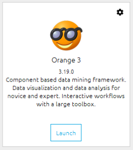
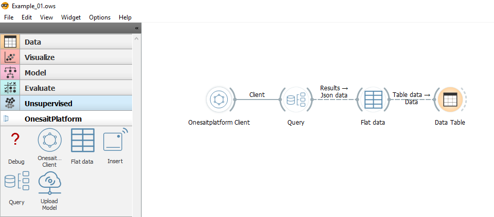

Orange3 Onesait Platform
========================

This is an add-on for [Orange3](http://orange.biolab.si). This add-on allows users to interact with a [Onesait Platform](https://onesaitplatform.atlassian.net/wiki/spaces/OP/overview?mode=global) installation.

Installation
------------

To install the add-on, run

    pip install .

To register this add-on with Orange, but keep the code in the development directory (do not copy it to 
Python's site-packages directory), run

    pip install -e .

Usage
-----

After the installation, the widgets from this add-on are registered with Orange. 

To run Orange from the terminal, use

    python -m Orange.canvas

To run Orange from Anaconda Navigator, launch 

The new widgets appears in the toolbox bar under the section OnesaitPlatform.

More information
----------------

Workflow examples can be found in ./onesaitplatform/examples.
- Example_01.ows: This example shows how to get data from the platform as Orange Table.
- Example_02.ows: This example shows how to train and evaluate two models and upload serialized models to Onesite Platform.

For more information, visit the page tutorials in [OnesaitPlatform documentation section](https://onesaitplatform.atlassian.net/wiki/spaces/OP/pages/76611643/DataMining+Tool+Guides).

Contact information
----------------

If you need support from us, please feel free to contact us at [support@onesaitplatform.com](mailto:support@onesaitplatform.com).

And if you want to contribute, send us a pull request.
